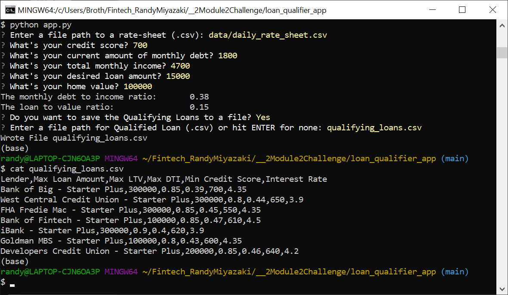

# FINTECH_RandyMiyazaki
#
$ FinTech Bootcamp Module 2 Challange due April 26, 2023

# Loan Qualifier App Project

Loan Qualifier App

This app allows the user the ability to save the qualifying loans to a CSV file to share the results as a spreadsheet.

## github.com repository link

	https://github.com/NvPahrump/Fintech_RandyMiyazaki/tree/main/Module_2_Challenge

## Technologies

This app is designed for pyton 3.7 on Windows 10.

It uses Python 3.7 libraries

    csv
    fire
    questionary
    pathlib

Runs under git-bash which uses

    GNU bash, version 5.2.15(1)-release (x86_64-pc-msys)

## Source Files:

    app.py

    qualifier/filters/credit_score.py
    qualifier/filters/debt_to_income.py
    qualifier/filters/loan_to_value.py
    qualifier/filters/max_loan_size.py

    qualifier/utils/calculators.py
    qualifier/utils/fileio.py

    data/daily_rate_sheet.csv

## To Run on Git-Bash:

    python app.py

## Git-Bash Dialog:

    Sample Git-Bash output:

	$ python app.py
	? Enter a file path to a rate-sheet (.csv): data/daily_rate_sheet.csv
	? What's your credit score? 700
	? What's your current amount of monthly debt? 1800
	? What's your total monthly income? 4700
	? What's your desired loan amount? 15000
	? What's your home value? 100000
	The monthly debt to income ratio:       0.38
	The loan to value ratio:                0.15
	? Do you want to save the Qualifying Loans to a file? Yes
	? Enter a file path for Qualified Loan (.csv) or hit ENTER for none: qualifying_loans.csv
	Wrote File qualifying_loans.csv
	(base)
	$ cat qualifying_loans.csv
	Lender,Max Loan Amount,Max LTV,Max DTI,Min Credit Score,Interest Rate
	Bank of Big - Starter Plus,300000,0.85,0.39,700,4.35
	West Central Credit Union - Starter Plus,300000,0.8,0.44,650,3.9
	FHA Fredie Mac - Starter Plus,300000,0.85,0.45,550,4.35
	Bank of Fintech - Starter Plus,100000,0.85,0.47,610,4.5
	iBank - Starter Plus,300000,0.9,0.4,620,3.9
	Goldman MBS - Starter Plus,100000,0.8,0.43,600,4.35
	Developers Credit Union - Starter Plus,200000,0.85,0.46,640,4.2
	(base)

## Screenshot:

## Git-Bash Input:

    This file contains sample Git-Bash input: command_history.txt

## File Output:

    List of inexpensive loans saved to CSV file qualifying_loans.csv

## Contributors

Randy Miyazaki modified app.py for the class assignment

## License

Intended for Randy Miyazaki and Fintech Bootcamp class personnel
