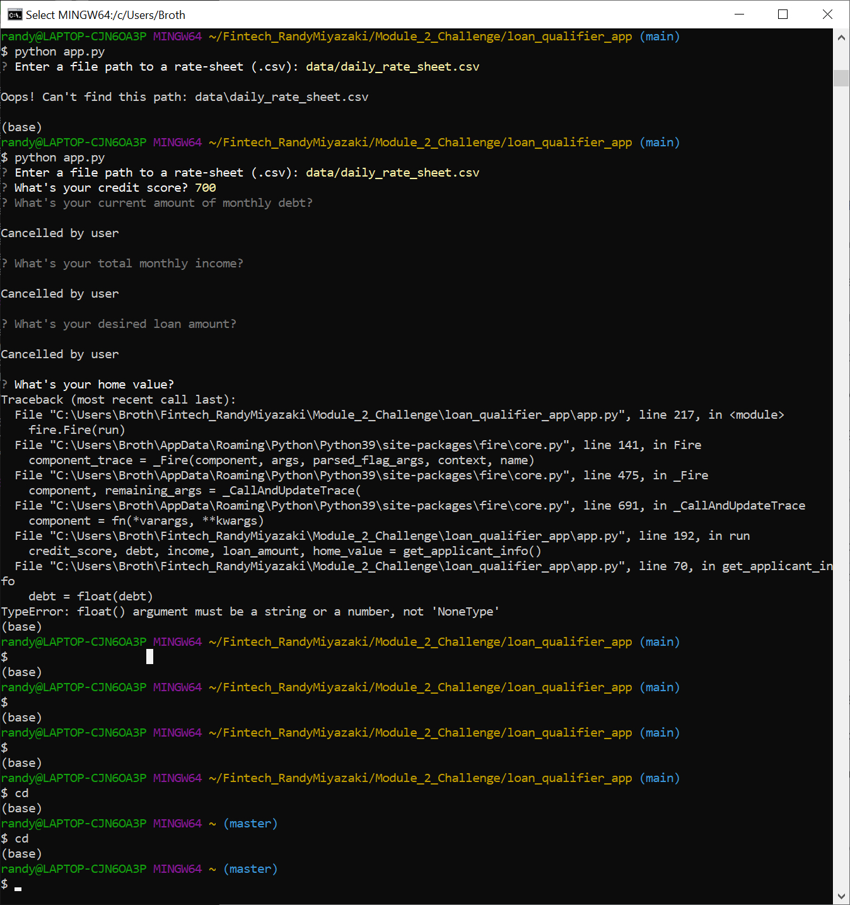

# FINTECH_RandyMiyazaki
#
$ FinTech Bootcamp Module 2 Challange due April 26, 2023

# Project Title

Loan Qualifier App

This app allows the user the ability to save the qualifying loans to a CSV file to share the results as a spreadsheet.

## Technologies

This app is designed for pyton 3.7 on Windows 10.

This app uses Python 3.7 libraries
    csv
    fire
    questionary
    pathlib

This app runs under git-bash which uses

    GNU bash, version 5.2.15(1)-release (x86_64-pc-msys)

Source Files:

    app.py

    qualifier/filters/credit_score.py
    qualifier/filters/debt_to_income.py
    qualifier/filters/loan_to_value.py
    qualifier/filters/max_loan_size.py

    qualifier/utils/calculators.py
    qualifier/utils/fileio.py

    data/daily_rate_sheet.csv

To Run on Git-Bash:

    cd /c/Users/Broth/Fintech_RandyMiyazaki/Module_2_Challenge
    python loan_analyzer.py

File Output:

    List of inexpensive loans saved to CSV file qualifying_loans.csv

CLI Output:

    Contains example Git-Bash output:
    
        command_history.txt

Screenshot:

---

## Installation Guide

In this section, you should include detailed installation notes containing code blocks and screenshots.

---

## Usage

This is a command line application

To run on git-bash enter

    $ python app.py

---

## Contributors

In this section, list all the people who contribute to this project. You might want recruiters or potential collaborators to reach you, so include your contact email and, optionally, your LinkedIn or Twitter profile.

---

## License

When you share a project on a repository, especially a public one, it's important to choose the right license to specify what others can and can't with your source code and files. Use this section to include the license you want to use.
